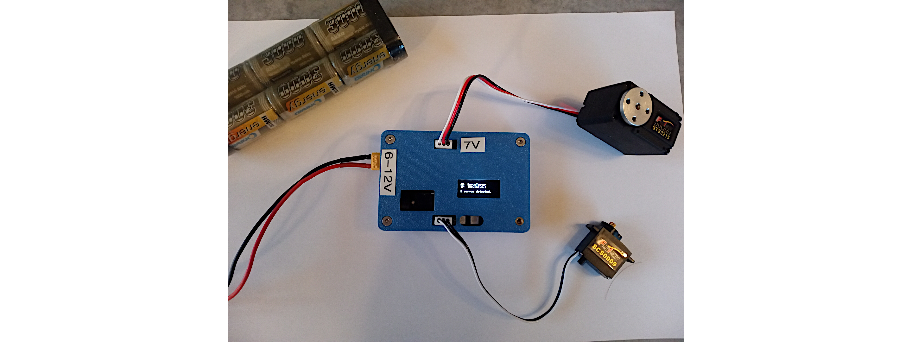

# WiFi STS servo tester

This repo provides an alternative firmware for [Waveshare's ESP32 servo driver board](https://www.waveshare.com/servo-driver-with-esp32.htm) to enable easy WiFi testing of multiple STS/SCS serial servos (or a mix of them at the same time).

Indeed, at the time of creation, Waveshare's firmware only supports either STS or SCS, but not both at once, and is mostly target toward single-servo application.

By contrast, the proposed firmware works with both servos as the same time, with a clear table view to interact with these servos (designed for a computer screen though technically the interface can also be displayed on a phone).


Here is a picture of proposed (but optional) hardware integration in a 3D printed box. This setup with two servos plugged in (both an STS and an SCS) correspond to the above webpage screenshot.



## Programming

The source code is located in the `WiFiSTSFirmware` folder.

Programming is done using the Arduino IDE, selecting `ESP32-Dev` as board type. You will need the [https://github.com/matthieuvigne/STS_servos](STS_servos) Arduino library (can be installed from the Arduino software directly).

The system works by creating a WiFi access point to which you will connect your computer / phone. To configure the name and password of this access point, modify the file `Constants.h` to change these two lines to your liking

```c++
// WIFI_AP settings.
#define AP_SSID "ServoTester"
#define AP_PWD "12345678"
```

Once the board is flashed, it will start broadcasting its WiFi network to which you can connect using the password you provided. Once connected, open a web browser and simply type `192.168.4.1` (this IP address is indicated on the LCD screen as a reminder) to bring up the servo control webpage.

The detection of the servos present on the bus is re-performed automatically when you connect. If you plug in another servo, click the `Rescan` button to update the servo list.


## Optional hardware

The STEP files for printing the holder box show in the image above are provided in the `hardware` folder. This box can contain both the [Waveshare's ESP32 servo driver board](https://www.waveshare.com/servo-driver-with-esp32.htm) and an optional [DC Buck adapter](https://www.waveshare.com/dc-buck-adapter-7.2v.htm) for working at higher voltages. An XT-30 connector (optional) is used for power instead of the barrel jack.